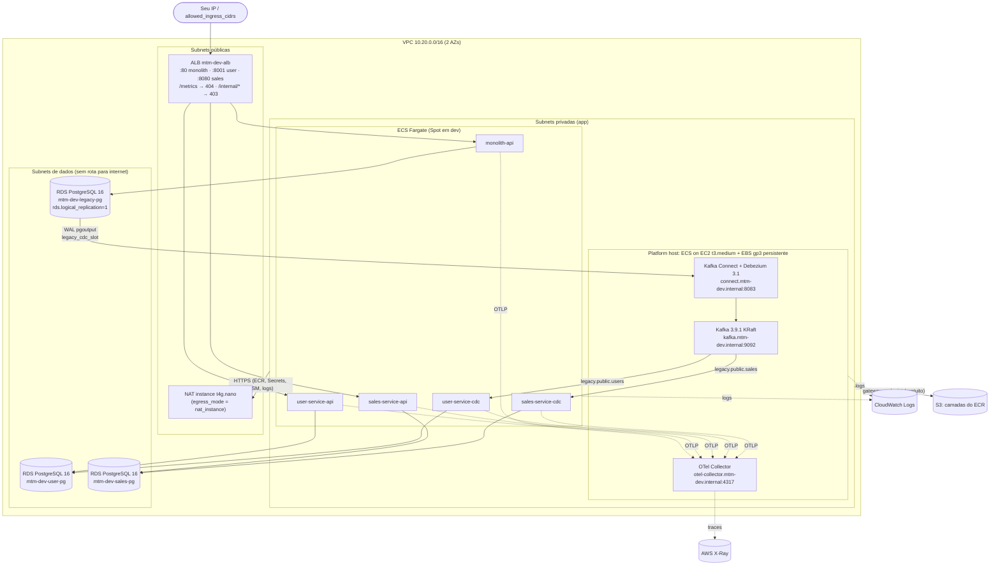

# Arquitetura AWS (ambiente dev)

Desenhada **depois** da auditoria em [current-state.md](current-state.md). As
decisões e alternativas estão nos ADRs em [adr/](adr/) e o custo em
[cost-estimate.md](cost-estimate.md).

## Visão geral

## Componentes

| Camada | Escolha | Motivo curto | ADR |
|---|---|---|---|
| Compute (APIs + CDC) | ECS **Fargate**, capacity provider `FARGATE_SPOT` em dev | sem servidor para gerenciar, preço por task, sem control plane | [0001](adr/0001-compute-platform.md) |
| Compute (stateful/JVM) | **ECS on EC2**: 1 "platform host" com volume EBS separado | o Kafka precisa de disco que sobreviva a restarts; Fargate não oferece isso | [0001](adr/0001-compute-platform.md) |
| Kafka | Kafka KRaft self-hosted (mesma imagem do lab) no platform host | MSK custaria ~5× mais para 1 broker de lab | [0002](adr/0002-kafka-platform.md) |
| Kafka Connect / Debezium | self-hosted no platform host | MSK Connect custaria ~US$ 80/mês; a mesma imagem garante compatibilidade | [0002](adr/0002-kafka-platform.md) |
| Bancos | 3× **RDS PostgreSQL 16** `db.t4g.micro`, single-AZ, gp3 | database-per-service preservado; RDS suporta logical replication | [0003](adr/0003-database-strategy.md) |
| Observabilidade (fase 1) | CloudWatch Logs + métricas AWS + alarmes; OTel Collector → X-Ray | Promtail não roda em Fargate; OTel preservado | [0004](adr/0004-observability-strategy.md) |
| State do Terraform | S3 versionado + `use_lockfile` (sem DynamoDB) | lock nativo do S3; o lock via DynamoDB está deprecated | [0005](adr/0005-terraform-state.md) |
| Egress | NAT instance (padrão dev) ou NAT Gateway (flag) | ~US$ 4 vs ~US$ 33/mês | [0006](adr/0006-network-egress.md) |
| Imagens | ECR: `mtm/monolith-api`, `mtm/user-service`, `mtm/sales-service` | um repositório por **imagem** (API e CDC compartilham a imagem) | – |
| Segredos | Secrets Manager + atributos write-only | senhas nunca entram no state ou no plan | [0003](adr/0003-database-strategy.md) |

## Redes e security groups (mínimo acesso)

| Origem | Destino | Porta | Observação |
|---|---|---|---|
| `allowed_ingress_cidrs` | ALB | 80, 8001, 8080 | nunca `0.0.0.0/0` sem `allow_public_ingress = true` |
| ALB | monolith / user / sales API | 8000 | SG por workload |
| APIs e CDC | RDS **do próprio serviço** | 5432 | o SG de cada banco lista quem entra (user DB: só user-api e user-cdc) |
| platform host (Debezium) | RDS legacy | 5432 | único acesso de fora do monólito ao legado |
| user-cdc / sales-cdc | Kafka (platform host) | 9092 | APIs não falam com o Kafka |
| APIs e CDC | OTel Collector | 4317/4318 | |
| platform host | APIs / CDC | 8000 / 9200 / 9201 | preparado para o Prometheus (fase 2) |
| workloads | internet | 443 via NAT | ECR, Secrets Manager, CloudWatch, SSM (endpoints públicos da AWS) |

Nenhum banco, Kafka ou Connect é exposto publicamente. Não há SSH nem par de
chaves: o acesso operacional usa **SSM Session Manager** (host) e **ECS Exec**
(containers).

## DNS interno

O namespace privado do Cloud Map é `mtm-dev.internal`:

- `kafka`, `connect`, `otel-collector` → IP privado do platform host (registrado pelo Terraform).
- `monolith-api`, `user-service-api`, ... → IPs das tasks Fargate (registrados pelo ECS). É a base do service discovery do Prometheus na fase 2.

## Separação: provisionamento × configuração de runtime

| Terraform provisiona | Fora do Terraform (runtime, runbook) |
|---|---|
| RDS com `rds.logical_replication=1` e `max_slot_wal_keep_size` | `CREATE ROLE debezium`, `GRANT rds_replication`, `REPLICA IDENTITY FULL` |
| Secret com a senha do usuário `debezium` | `CREATE PUBLICATION legacy_cdc_publication`, `legacy_cdc_slot` |
| Serviço Kafka Connect com o `EnvVarConfigProvider` | registro do `legacy-cdc-connector` via REST |
| Kafka com auto-create | tópicos `legacy.public.*` (criados pelo Debezium) |
| Imagens no ECR (repositórios) | build/push das imagens (CI dos repositórios de serviço) |

Motivo: o Terraform precisaria de conectividade de rede com o banco e com o
Connect (que são privados) e ficaria acoplado ao ciclo de vida dos dados. Veja
[ADR 0002](adr/0002-kafka-platform.md) e [runbooks/cdc-bootstrap.md](runbooks/cdc-bootstrap.md).

## Autoscaling

| Workload | Estratégia |
|---|---|
| APIs | target tracking: CPU 60% e `ALBRequestCountPerTarget` 500; `min = desired_count`, `max = max_capacity` |
| CDC consumers | **sem autoscaling**. 1 partição = 1 consumidor ativo por grupo; mais tasks ficariam ociosas e só adicionariam rebalanceamentos. Escalar exige mais partições, e a ordenação por chave (id da linha) continua garantida porque o Debezium particiona pela chave primária |
| Kafka / Connect / OTel | fixo em 1 no platform host (portas fixas, `host` network) |

Um detalhe de drift: quando o autoscaling sobe `desired_count` acima do valor
do Terraform, o próximo `plan` propõe voltar ao valor configurado, e
`plan -refresh-only` mostra isso como drift. É esperado e está documentado em
[drift-detection.md](drift-detection.md).

## Nomes e tags

Veja [naming.md](naming.md). Padrão `mtm-<env>-<componente>`. As tags padrão vêm do
provider: `Project`, `Environment`, `ManagedBy=terraform`, `Repository`, `Stack`, `CostCenter`.
