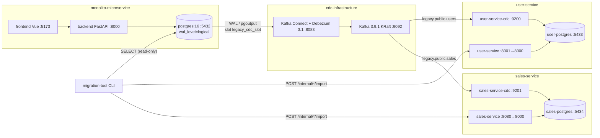

# Estado atual do laboratório (auditoria)

Levantamento feito lendo o código e a configuração reais dos 7 repositórios irmãos
(`docker-compose.yml`, `Dockerfile`, entrypoints, `config.py`, `.env.example`,
scripts e configs de observabilidade) em 2026-09-23. Nada aqui é suposição: quando
algo não foi verificado, está marcado como tal.

## Topologia local

Todos os repositórios sobem com `docker compose` e se falam pela rede Docker externa
compartilhada **`migration-network`** (criada uma vez com `docker network create`).
Cada repositório também tem sua rede `default` privada (API ↔ banco).

## Inventário de componentes

| Component | Repository | Runtime | Port (container → host) | Database | Dependencies | Health check | Metrics | Persistent state | Deployment concerns |
|---|---|---|---|---|---|---|---|---|---|
| monolith-api | monolito-microservice | python:3.12-slim, FastAPI/uvicorn, SQLAlchemy + psycopg3, Alembic | 8000 → 8000 | legacy (`monolith`) | legacy-postgres, otel-collector (opcional) | `GET /health` (**sempre 200, não testa o banco**) | `/metrics` (Prometheus) + traces OTLP | nenhum | entrypoint espera o banco e roda `alembic upgrade head`; roda como root |
| monolith-frontend | monolito-microservice | node:22-alpine, **Vite dev server** | 5173 → 5173 | – | monolith-api (`VITE_API_URL`) | – | – | nenhum | não é build de produção; fora do escopo da fase 1 |
| legacy-postgres | monolito-microservice | postgres:16 | 5432 → 5432 | `monolith` (users, sales) | – | `pg_isready` | via postgres-exporter-legacy | volume `postgres_data` | `wal_level=logical`, `max_wal_senders=4`, `max_replication_slots=4`; fonte da verdade |
| user-service-api | user-service | python:3.12-slim, FastAPI, psycopg3, Alembic, usuário não-root | 8000 → 8001 | `user_service` | user-postgres | `GET /health` (testa o banco, 503 se falhar) | `/metrics` + OTLP | nenhum | `alembic upgrade head` no entrypoint; `/internal/users/import` sem autenticação |
| user-service-cdc | user-service | mesma imagem, `python -m app.cdc` | 9200 (métricas) | `user_service` | Kafka `legacy.public.users`, grupo `user-service-cdc` | nenhum HTTP | `:9200/metrics` + OTLP | offsets no Kafka | não é endpoint HTTP; `enable.auto.commit=false` (commit após a transação); também roda `alembic upgrade head` |
| user-postgres | user-service | postgres:16-alpine | 5432 → 5433 | `user_service` | – | `pg_isready` | postgres-exporter-user | volume `user_postgres_data` | credenciais fixas no compose |
| sales-service-api | sales-service | python:3.12-slim, FastAPI, **psycopg2**, Alembic | 8000 → 8080 | `sales` | sales-postgres | `GET /health` | `/metrics` (+ OTLP se configurado) | nenhum | `/internal/sales/import` sem autenticação; roda como root |
| sales-service-cdc | sales-service | mesma imagem, `python -m app.cdc` | 9201 (métricas) | `sales` | Kafka `legacy.public.sales`, grupo `sales-service-cdc` | nenhum HTTP | `:9201/metrics` + OTLP | offsets no Kafka | idem user-service-cdc |
| sales-postgres | sales-service | postgres:16-alpine | 5432 → 5434 | `sales` | – | `pg_isready` | postgres-exporter-sales | volume `sales-postgres-data` | credenciais fixas no compose |
| kafka | cdc-infrastructure | apache/kafka:3.9.1, KRaft (broker+controller, 1 nó) | 9092 (interno), 29092 → 9092 (host) | – | – | `kafka-broker-api-versions.sh` | kafka-exporter | volume `kafka_data` (tópicos, offsets, estado do Connect) | RF=1, PLAINTEXT, auto-create de tópicos (1 partição), `CLUSTER_ID` fixo |
| kafka-connect / debezium | cdc-infrastructure | quay.io/debezium/connect:3.1 | 8083 | lê do legacy | Kafka, legacy-postgres | `curl :8083/` | connect-status-exporter, JMX :9012 | tópicos `_connect_configs/_offsets/_status` | conector registrado via REST por script (runtime, não compose) |
| prometheus | observability-infrastructure | prom/prometheus:v2.54.1 | 9090 | – | todos os `/metrics` | `/-/healthy` | – | volume `prometheus_data` (15d) | 12 regras de alerta, sem Alertmanager; recebe remote-write do Tempo |
| grafana | observability-infrastructure | grafana/grafana:11.2.0 | 3000 | – | Prometheus, Loki, Tempo | – | – | volume `grafana_data` | 7 dashboards provisionados; admin/admin padrão |
| loki | observability-infrastructure | grafana/loki:2.9.8 | 3100 | – | – | – | – | volume `loki_data` (14d) | filesystem, boltdb-shipper |
| promtail | observability-infrastructure | grafana/promtail:2.9.8 | – | – | **docker.sock** | – | – | – | depende do socket do Docker: **não portável para Fargate** |
| tempo | observability-infrastructure | grafana/tempo:2.5.0 | 3200, 4317 | – | – | – | span-metrics → Prometheus | volume `tempo_data` (14d) | storage local |
| otel-collector | observability-infrastructure | otel/opentelemetry-collector-contrib:0.108.0 | 4317, 4318, 13133 | – | Tempo | `:13133` | `:8888` | – | só pipeline de traces |
| postgres-exporter ×3 | observability-infrastructure | postgres-exporter v0.15.0 | 9187-9189 | lê os 3 bancos | bancos | – | sim | – | query customizada de lag do slot no legado |
| kafka-exporter | observability-infrastructure | danielqsj/kafka-exporter:v1.7.0 | 9308 | – | Kafka | – | sim | – | filtros `legacy\..*` e grupos CDC |
| connect-status-exporter | observability-infrastructure | build local (python) | 9877 | – | Connect REST | – | sim | – | única imagem custom da observabilidade |
| debezium-jmx-exporter | observability-infrastructure | bitnami/jmx-exporter:**latest** | 5556 | – | JMX do Connect | – | sim | – | tag não fixada (best-effort) |
| migration-tool | migration-tool | CLI Python | – | lê legacy (read-only), SQLite local | APIs `/internal/*/import` | – | relatórios em `./reports` | `migration_state.db` (SQLite) | executado sob demanda, não é serviço |
| migration-e2e-tests | migration-e2e-tests | pytest | – | lê os 3 bancos | todo o lab | – | resultados em `test-results/` | – | URLs/DSNs **hardcoded em localhost**; testes de falha usam `docker stop/start` |

### Identidades de CDC (devem ser preservadas)

| Item | Valor |
|---|---|
| Conector | `legacy-cdc-connector` (`io.debezium.connector.postgresql.PostgresConnector`, `tasks.max=1`) |
| Plugin | `pgoutput` |
| Slot | `legacy_cdc_slot` |
| Publication | `legacy_cdc_publication` (somente `public.users`, `public.sales`, `autocreate.mode=disabled`) |
| Prefixo de tópicos | `legacy` → `legacy.public.users`, `legacy.public.sales` |
| Snapshot | `snapshot.mode=no_data` (dados históricos vêm da migration-tool) |
| Usuário de replicação | `debezium` (`REPLICATION`, `SELECT` em users/sales), `REPLICA IDENTITY FULL` nas duas tabelas |
| Grupos de consumidores | `user-service-cdc`, `sales-service-cdc` (`auto.offset.reset=earliest`) |

### Testes

Informado: 222 testes, 0 falhas (unit, integration, E2E, chaos/failure). **Não reexecutei
os testes nesta auditoria.** As suítes E2E e de falha dependem de `localhost` e de
`docker stop/start`, então precisarão ser parametrizadas (por exemplo com
`terraform output -json`) para rodar contra a AWS.

## Achados que influenciam o desenho na AWS

1. **Health check do monólito não testa o banco.** O ALB vai considerar o monólito saudável mesmo com o banco fora. A mudança recomendada fica no repositório do monólito, não aqui.
2. **Toda task roda migrações no start** (API e consumer CDC). Com mais de uma task subindo ao mesmo tempo existe corrida de `alembic upgrade head`. O próximo passo é uma task ECS de migração one-off antes do deploy.
3. **`/internal/*/import` não tem autenticação.** O ALB bloqueia `/internal/*` (403) e só libera para CIDRs listados em `internal_api_allowed_cidrs`.
4. **`/metrics` fica na mesma porta da API.** O ALB responde 404 para `/metrics`, e o Prometheus (fase 2) raspa as tasks diretamente.
5. **Os tópicos têm 1 partição (auto-create).** Um consumer group aceita no máximo 1 consumidor ativo por partição, por isso os consumers CDC não têm autoscaling e `desired_count` é limitado a `kafka_default_partitions`.
6. **Consumers com commit manual pós-transação** (at-least-once com apply idempotente). Uma interrupção por Fargate Spot pode reprocessar mensagens, o que é seguro.
7. **Kafka com 1 nó, RF=1, PLAINTEXT.** É aceitável para o lab. O Kafka precisa de **disco persistente**, porque tópicos, offsets de consumidores e o estado do Connect vivem nele.
8. **`enable-cdc.sh` usa `docker exec` e o atributo `REPLICATION`.** No RDS isso não existe: usa-se `GRANT rds_replication`, e o acesso ao banco é via SSM port forwarding. Veja [runbooks/cdc-bootstrap.md](runbooks/cdc-bootstrap.md).
9. **Credenciais fixas nos compose** (`postgres/postgres`, `user_service/user_service`, `sales/sales`, Grafana `admin/admin`). Na AWS as senhas são geradas e vão para o Secrets Manager.
10. **Drivers diferentes:** o sales-service usa `postgresql+psycopg2`, os demais `postgresql+psycopg`. O `DATABASE_URL` de cada secret respeita isso.
11. **Promtail depende do docker.sock.** No Fargate os logs vão para o CloudWatch Logs (driver `awslogs`).
12. **Frontend é o servidor de desenvolvimento do Vite.** Fica fora da AWS nesta fase (ele continua local e aponta para o ALB).
